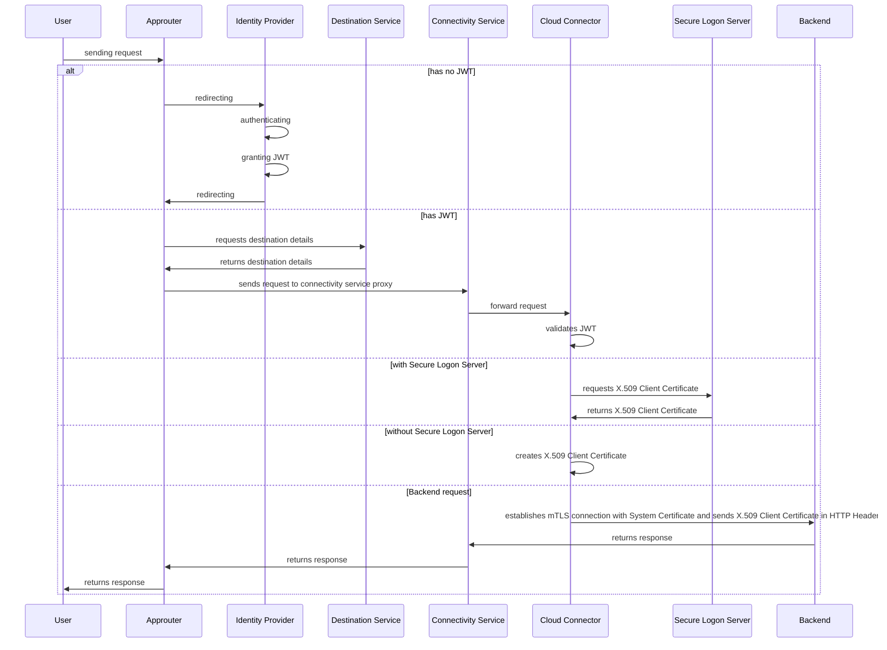

# Principal Propagation

```mermaid
sequenceDiagram
  User->>Approuter: sending request
  alt has no JWT
    Approuter->>Identity Provider: redirecting
    Identity Provider->>Identity Provider: authenticating
    Identity Provider->>Identity Provider: granting JWT
    Identity Provider->>Approuter: redirecting
  else has JWT
    Approuter->>Destination Service: requests destination details
    Destination Service->>Approuter: returns destination details
    Approuter->>Connectivity Service: sends request to connectivity service proxy
    Connectivity Service->>Cloud Connector: forward request
    Cloud Connector->>Cloud Connector: validates JWT
  else with Secure Logon Server
    Cloud Connector->>Secure Logon Server: requests X.509 Client Certificate
    Secure Logon Server->>Cloud Connector: returns X.509 Client Certificate
  else without Secure Logon Server
    Cloud Connector->>Cloud Connector: creates X.509 Client Certificate
  else Backend request
    Cloud Connector->>Backend: establishes mTLS connection with System Certificate and sends X.509 Client Certificate in HTTP Header
    Backend->>Connectivity Service: returns response
    Connectivity Service->>Approuter: returns response
    Approuter->>User: returns response
  end
```
